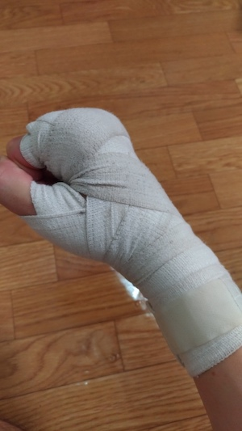

# 2017年9月

--------------------------------------------------------------------------------


## 9月27日

浅草の[ジェラート屋](https://tabelog.com/tokyo/A1311/A131102/13183933/)がかなり空いてて，この辺では世界カフェに次ぐお気に入りスポットになった．
今のところ２回行って，店は広い割に客が毎回１人or２人くらいしかいない．

今日で博士課程修了のために必要な単位やシステムを把握した．やはりよくわからないキャリアに関する講義をいくつか取らなければならず，残念な気分になった．

## 9月26日

けん玉とレゴをやった．趣味としてけっこう良い気がする．

博士課程を修了するために，必要な単位というものがなんなのかしっかりわかっていないと気づいた．．

講義は始まっているらしいが，まだ大学へ行っていないのでやばいかもしれない．
前期は(ゼミを除いて)1単位しか取っておらず，不安感が．．．


## 9月24日

日記を更新はしていたがアップロードし忘れていた．
友人にバンテージを貰い，巻き方を教わる．



## 9月21日

研究室の大掃除に参加した．自分は窓に住んでる蜘蛛の巣退治係だったけれど，虫が苦手で何もできず，結局虫に強い後輩に除去してもらった．
なぜ，あんなに蜘蛛が大量にいるのかね．

## 9月20日

浅草のconaへいった．昔バイトしていたときや遊んでたときに新宿のconaにはよくいっていた．この数年で各地にすごい増えた気がする．
いくところのほとんどにある気がする．

conaってどういう意味かなと思って調べたら粉と[これ](http://www.urbandictionary.com/define.php?term=cona)しかでてこなかった．


## 9月19日

マトロイドゼミに参加した．未だに定義等細かい見逃しをしてしまう．
各要素に重み付きのものが登場し，なんとなく有用性の雰囲気を感じた．
来週発表なので不安感が．．．ただ，やっぱり発表すると一番理解できるし，復習もできて，自分のためを思うと発表するべきなんだよなあ．

修士の学生からもうすぐ講義始まるという話を聞いた．今年度まだ1単位しか取れていないから，さすがになにか取らないと．．

夜にボクシングジムの見学へ行った．オーナー（会長？）はとても良さそうな方で，入会することを確信した．
初回特典で，入会金無料・ボクシンググローブということでかなり良い．しかも学割も効く．
最近思うのだけれど，博士課程学生は学割を使っていいのかな〜．年齢は24歳だし，なんとなく申し訳無さを感じる．

そのあと家で自転車のチェーンを修理した後，フィールドワークにいく．今日は街全体が空いていた．


## 9月18日

世界カフェへいった．今日は三連休最終日ということもあり，客席が80%くらい埋まっていた．これはおそらく初めてだと思う．

その後，バーガーキングへ夕飯を食べに自転車で移動していたら，自転車のチェーンが切れてしまった．
全くこげないので友人の肩につかまりながら並走して移動していたら，自転車でいろいろ挑戦していた中学時代を思い出した．

## 9月16日

うちから徒歩5分のところにボクシングジムができるらしい．．．こんな奇跡があるだろうか．
自分は運のアビリティはそこそこ高い気がしている．

今日は部活の同期と横浜で昼飯を食べたり，ショッピングをした．わりと寒くて，売っている服は秋物ばかりで，秋を感じる．

よくデパートとかに入っている服屋(セレクトショップだけれど，自社製品ばかりのところ)に5店舗くらいいったけれど，(セレクト品ですら)どれも売っているものがほぼ同じに見えた．
こう思うと，もはやAmazonとかで買ったほうがやすいし個性を出せるのかもしれない．といいつつ，個性を出すことは求めていないので，ここで服を一着買って終了した．


## 9月13-15日

OR学会で関西大学へ行った．いろいろあったが，書くのも大変なので省略．
(当たり前だけれど)自分からしたらすごい人たちでもいろいろな苦労があるのか，と今回の学会のいろいろな場面で感じた．

今回泊まったホテルがある江坂駅は関西大学へのアクセスが微妙なので，次回（あるのかわからないが）は気をつけたい．

## 9月10日

陸上の桐生選手が100m走で日本人初の9秒台をだした．新聞を読むと，桐生選手は前からかなり期待されており，かなり重圧を感じていたとの，話が書かれていた．

自分の他者や社会からの評価が自己評価より低い，と嘆く人は多い．実際考えてみたら周りにはあまりいないかもしれないが．
逆の，自分の他者や社会からの評価が自己評価より高い，ことについて困ってる人ってのも多いと思う．というか，これのほうが自分は苦手だし，危険状態だと思う．
過大評価状態の場合，「そのひとの期待に沿うべき方向に向かわなきゃ」感がでるし，期待に応えられなかったときに周りからの無駄な失望が起きる．
そんなこんなで，いろいろとストレスやプレッシャーを感じてしまい，パフォーマンスが落ちる．まあ，そこの過大評価像に自分をフィットさせられるという強いヤツもいるだろうけれど(自分の周りのデキる人たちはこのケースも多い気がする)．
あたかも自分は期待されているかのような文章だけれど，桐生選手と大きく違う点は，そもそも，そこまで誰からも期待されていないということだ．

あと，話が急に変わるのだけれど，pythonでjupyter notebookをいじるとき，tqdmがうまく表示されず，残念に思っていた．tqdmとは，for分実行時の進捗バーを表示するライブラリで，これを使うといちいちcount += 1とprint (count)みたいなことをしなくてよい．今日気づいたのはtqdmもjupyter用のものがあったということだ．(参考：http://kujira16.hateblo.jp/entry/2016/12/13/000000)
```
import time
from tqdm import tqdm_notebook as tqdm

s = 0
for i in tqdm(range(20)):
    s += i
    time.sleep(0.1)
print(s)
```

## 9月9日

フィールドワークに励んだせいもあり，日記をさぼってしまった．

先週は夏ゼミで水野・中田研の学部・修士学生の発表を聞いた．
中田研の学生は例年に増して，機械学習色が強まっているような印象を受けた．水野研はコンテナとスケジューリングがメイン．
今回はOBの田中さんも参加して，（不在の水野先生の代わりに？）いろいろツッコミを入れてくれていた．
田中さんの発表では，(自分たち学生と比べて)研究をするモチベand研究の立ち位置の紹介がうまいなと感じた．

あと，久しぶりに映画「[GO](https://youtu.be/xy67O6yYlGo)」をみた．
この映画は自分の中で好きな映画ランキングTOP3には入ると思う．ちなみにアマゾンプライムで無料で見れる．

>杉原は韓国の国籍を持つ所謂｢在日｣｡中学までは民族学校に通っていたが､広い世界を見たくなり日本の普通高校に入学した｡未だに将来の夢も進路も決まらず､ﾊﾞｽｹ部をやめて以来､喧嘩しかすることがない｡ある日､杉原は親友の加藤のﾊﾞｰｽﾃﾞｨﾊﾟｰﾃｨｰで声をかけてきた少女･桜井と突然の恋に落ちる｡しかし､いつかは告白しなきゃならない｡自分が｢在日｣であることを...｡そんなある日､親友の正一が､駅で少年に刺されてしまい･･･直木賞を受賞した金城一紀の同名ベストセラーを映画化。

あらすじだけみると重苦しいけど，本当は全然そんなことはない．

GOの舞台挨拶の[動画](https://youtu.be/rUCOCj2snBY)が落ちてたけど，昔からこんな感じだったのかと驚いた．十年以上，主張が変わらないのはすごいな．


## 9月4日
午前中はバイトで作業の引き継ぎを行った．
うまい説明ができず，混乱させてしまったかもしれない．午後はマトロイドゼミに参加．マッチングに関するマトロイドについて学ぶ．再来週くらいに発表するかもになるやや不安である．

夜は，松井先生に誘っていただき飲みに行った．
皆さん予定があるようで参加者は自分ひとりで寂しかったが，そのおかげでいろいろな話を聞けてとても楽しく飲めた．特に先生方の博士進学の理由（背景？）はそれぞれ面白かった．

話をしていて，(自分でもわかっていたが)研究の基礎的な常識がやはり欠けていることを再認識した．特に以下のふたつ．

 - データ構造
 - 計算量理論

今後はもう少し勉強 **も** 頑張っていこう．

あといろいろな会議をまとめているページを教えていただいたのでメモ
http://www.ics.sophia.ac.jp/miyamoto/jsiamdwiki/index.php?%B4%D8%CF%A2%B2%F1%B5%C4

## 9月3日
Tea party at home


## 9月2日

表参道へ久しぶりに行った（正確には通過しただけ）．ふと思ったが，渋谷へ通じるキャットストリートでキャットを一度も見たことがない．

前は新しいなにかを学ぶときに「◯◯はなんの役に立つのか？」ということがとても気になっていた．
逆に，役に立ちそうもないことはあまり学ぶ気が起きなかった．
最近は何に役に立つとかそこまで気にならなくなってきた．
というのも，こういう類のことは学んでからわかることのほうが多く，これらのことは深い理解しないと伝わりづらいと(あくまでも私は)思いはじめたからだ．だから，どちらかというと，自分の場合は，その◯◯を好きな人や熱心に学んでいる人が魅力的であると，「あの人がそれだけ，はまっているのであればなんか面白いのかな」と思いやる気がでて，その人と同じ目線に立って物事を考えたいと思い，学ぶモチベがアップする．まあ，これは人それぞれだとは思うけど．


## 9月1日

今日は丸一日，娯楽の日だった．世界カフェからはじまり，浅草でいつものゲームセンターでバスケをし，気になっていた猫カフェへ行った．
夜には，懐かしのジェンガ(調べたら各棒の重さが同じではないらしい)とウノで盛り上がった．

こうやってあらためてみると，小学生からまるで進化していない．

> 悔しい．悔しい．悔しい．だが，これでいい！ (https://youtu.be/03ynheVJRkA)
