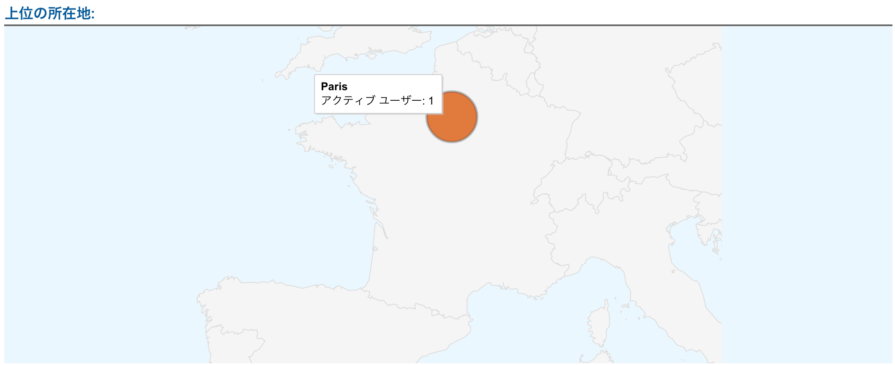

# Selenium利用時にIPアドレスを毎アクセス変えたい

2018年1月執筆


> pythonでseleniumを利用時に，毎アクセスIPアドレスを変えれないのか?

というモチベーションを持っている人は多いと思う．
それは以下の方法で（たぶん）実現可能．Pythonだけど，Pythonじゃなくてもほぼおなじかと．
基本的に参考のリンク先を読めばわかるが，日本語の情報があまりなかったので一応共有．


### 1. Tor Browserをインストール
[こちら](https://www.torproject.org/download/download)からインストールする．

### 2. Tor Browserを起動

selenium利用時は常に起動しておく．

### 3. Seleniumを使う

以下のprofileを渡して実行．もしうまくいかない場合はTor Browserの右上の設定ボタンから「Preferences/Advanced(タブ)/Network(タブ)/Connection/Settings」が↓の設定と整合的かを確認する．

```
from selenium import webdriver
firefox_profile = webdriver.FirefoxProfile()
firefox_profile.set_preference('network.proxy.type', 1)
firefox_profile.set_preference('network.proxy.socks', '127.0.0.1')
firefox_profile.set_preference('network.proxy.socks_port', 9150)

browser = webdriver.Firefox(firefox_profile=firefox_profile)

# チェック
browser.get("https://takazawa.github.io/")

```


### 確認

確認のために自分のウェブサイトにアクセスして位置情報を見たところParisになっていた．




### 参考

- http://www.onurvarol.com/blog/web-scraper-with-no-ip-limit-problem/
